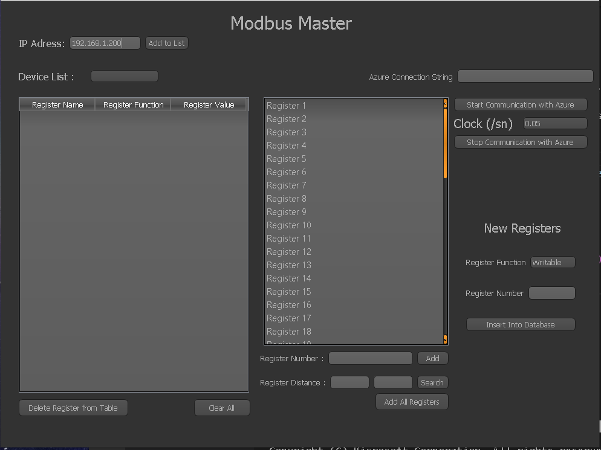

# Modbus TCP/IP - IoT - GUI

## Installing Dependecies

- Firstly download the program zip file
- Then after install dependecies using this command in bash
 ```bash
 pip install -r requirements.txt
 ```





 ## Libraries
 - GUI library : https://pypi.org/project/PyQt5/
 - Database : https://www.sqlite.org/index.html
 - Modbus Protocol Library : https://pypi.org/project/pymodbus/
 - Azure Communication Library : https://github.com/Azure/azure-sdk-for-python

 ## Azure Communication
 
 - Send data to Azure IoT hub from device : https://docs.microsoft.com/en-us/azure/iot-develop/quickstart-send-telemetry-iot-hub?pivots=programming-language-python
 - Send cloud-to-device messages with IoT Hub : https://docs.microsoft.com/en-gb/azure/iot-hub/iot-hub-python-python-c2d
 
 ### Code Examples
 #### Send cloud-to-device messages with IoT Hub
  ```python
 def message_handler(message):

    a = str(message)

    list = a.split(",")

    newlist = []

    for i in list:

        newlist.append(int(re.search(r'\d+', i).group()))
    
    print(newlist)

    client = ModbusClient(host="192.168.1.200", port = 502)

    client.open()

    client.write_multiple_registers(newlist[0], [newlist[1]])
  
def getDatafromAzure():
    print ("Starting the Python IoT Hub C2D Messaging device sample...")

    # Instantiate the client
    clientAzure = IoTHubDeviceClient.create_from_connection_string(CONNECTION_STRING)

    print ("Waiting for C2D messages, press Ctrl-C to exit")
    try:
        # Attach the handler to the client
        clientAzure.on_message_received = message_handler

        while True:
            time.sleep(1000)
    except KeyboardInterrupt:
        print("IoT Hub C2D Messaging device sample stopped")
    finally:
        # Graceful exit
        print("Shutting down IoT Hub Client")
        clientAzure.shutdown()
 ```
 #### Send data to Azure IoT hub from device
 ```python

# 1- First thing you have to do is go Azure portal and open bash command line then write az iot hub monitor-events --hub-name modbus-tcp-iot --device-id mypi
# 2- this command starts monitoring for your device

def sendDatatoAzure(registerNumber, distance):

    clientAzure = IoTHubDeviceClient.create_from_connection_string(CONNECTION_STRING)

    client = ModbusClient(host="192.168.1.200", port = 502)

    client.open()

    data = client.read_holding_registers(registerNumber, distance)

    message = Message(data)

    clientAzure.send_message(str(message))
    
if __name__ == '__main__':

    sendDatatoAzure()
    #getDatafromAzure()
 ```
 ## Work Principle
 
 -You can just enter the ip address of the connected slave device and start reading the register values.
